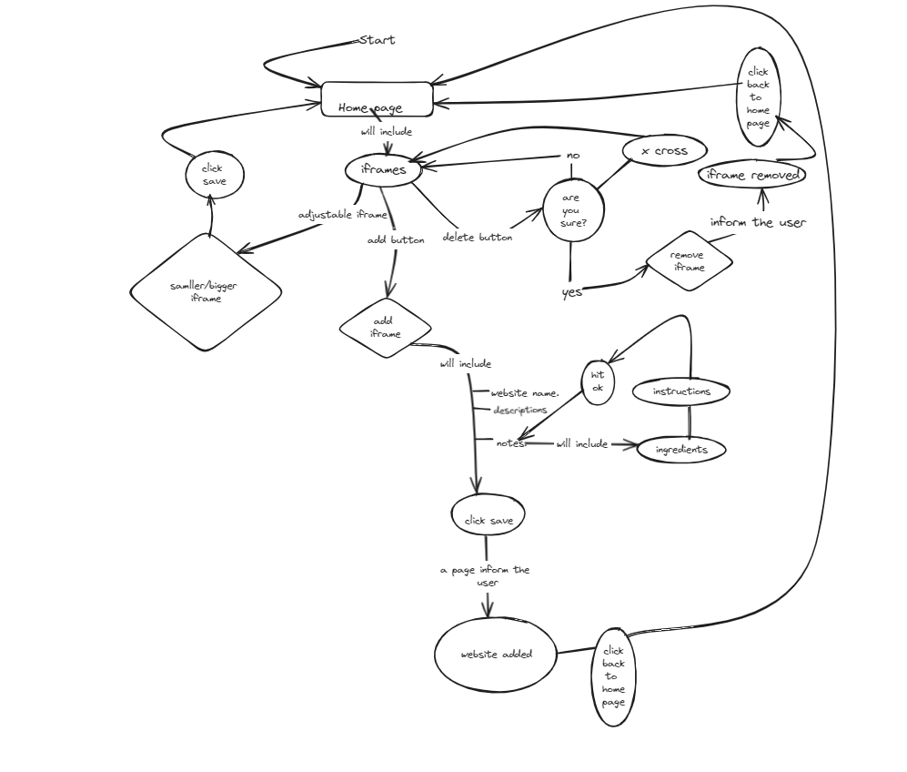
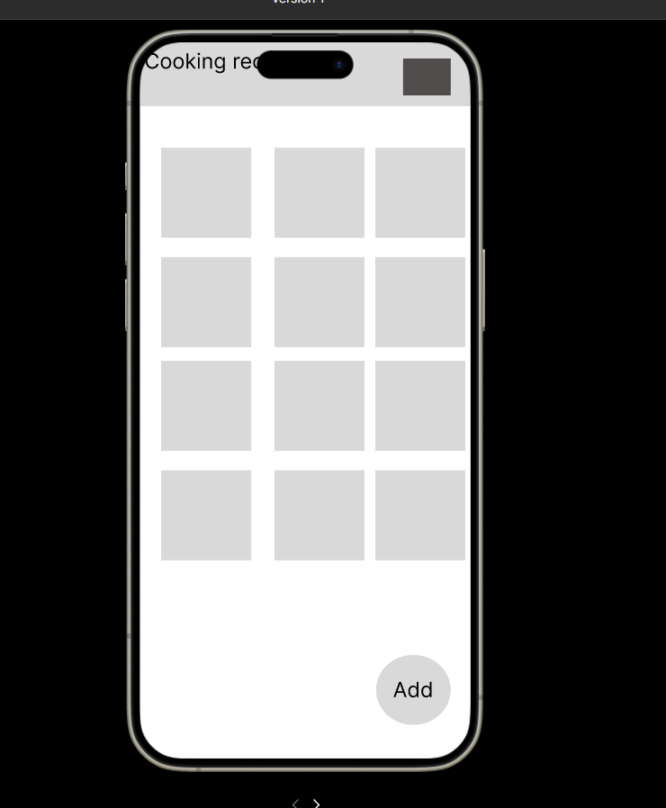
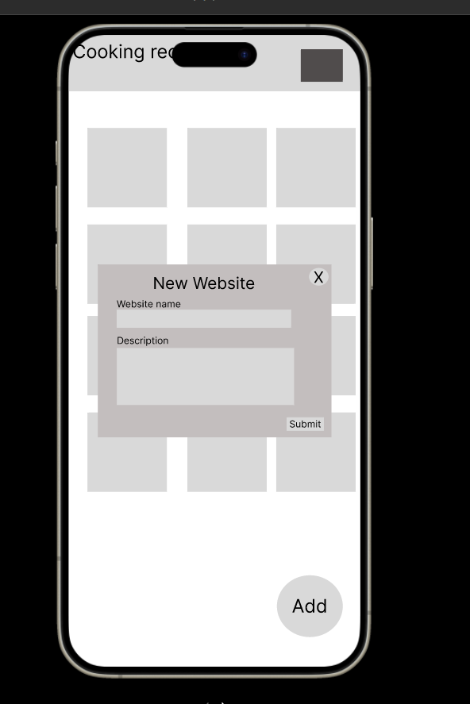

# Development of a Database-Linked Website for NCEA Level 2

Project Name: **PROJECT NAME HERE**

Project Author: **YOUR NAME HERE**

Assessment Standards: **91892** and **91893**

-------------------------------------------------

## Design, Development and Testing Log

### 16/05/2024

Today I am working on creating a database design for my website and also design for UI:

### DATE HERE
20/05/24
Today I am working on a more simplified version of my website design:

### DATE HERE
21/05/24
Today I am working on my flow chart version 3. I tried to simplify it by excluding/cutting out unnecessary part that dosen't need to be shown and try to keep it breif to make it smaller while also keeping the design at a stage where it includes the whole concept of what the website is about

### DATE HERE
27/05/24:
Today I am testing out design my version 1 of user interface and see how is it working on each device platform that my dad has access to: 

### DATE HERE

Replace this test with what you are working on

Replace this text with brief notes describing what you worked on, any decisions you made, any changes to designs, etc. Add screenshots / links to other media to illustrate your notes where necessary.

### DATE HERE

Replace this test with what you are working on

Replace this text with brief notes describing what you worked on, any decisions you made, any changes to designs, etc. Add screenshots / links to other media to illustrate your notes where necessary.