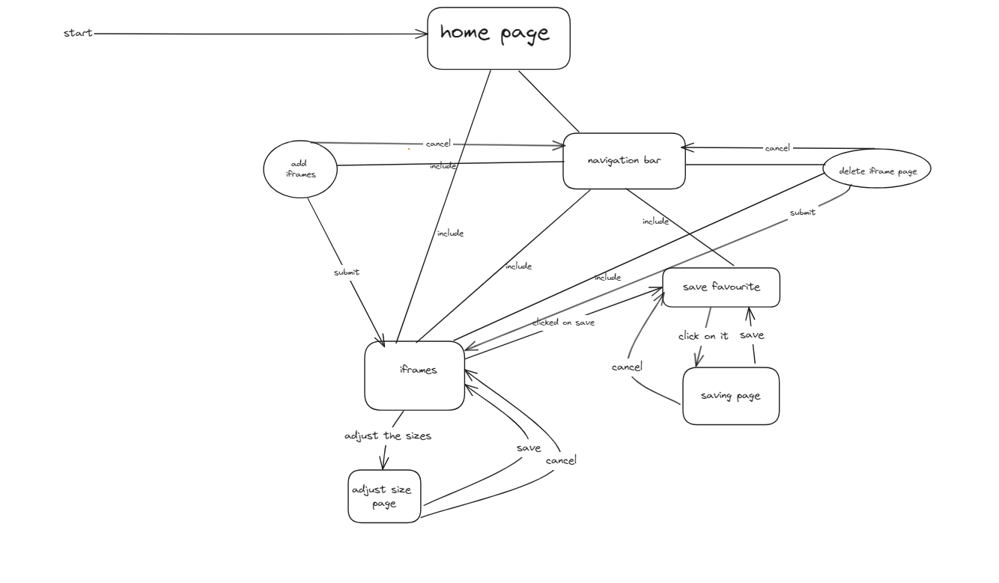
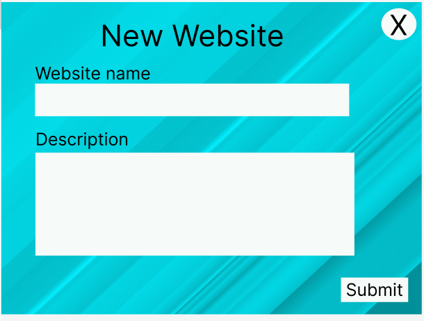

# Development of a Database-Linked Website for NCEA Level 2

Project Name: **PROJECT NAME HERE**

Project Author: **YOUR NAME HERE**

Assessment Standards: **91892** and **91893**

-------------------------------------------------

## Design, Development and Testing Log
### 16/05/2024

Today I am working on creating a database design for my website and also design for UI:

### 20/05/24

Today I am working on a more simplified version of my website design:

### 21/05/24

Today I am working on my flow chart version 3. I tried to simplify it by excluding/cutting out unnecessary part that dosen't need to be shown and try to keep it breif to make it smaller while also keeping the design at a stage where it includes the whole concept of what the website is about

### 27/05/24

Today I am testing out design my version 1 of user interface and see how is it working on each device platform that my dad has access to: 

for this one, I thnk I need to adjust the headers a bit since it is being hidden by the front camera of the phone

for this one again, I thnk I need to adjust the headers a bit since it is being hidden by the front camera of the phone, but however i am just showing the add button function in this one.

### 10/06/24
Today I am focusing getting my colour choices for my 1st choice

Here is my first choice for my add form.

Here is my first choice of colour for my homepage and my save page
### 11/06/24
Today I've been working on my version 3
